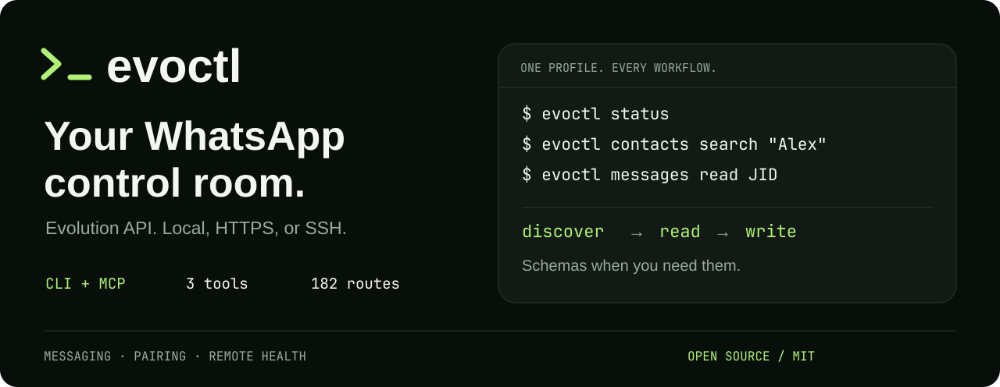

<p align="center">
  
</p>

<p align="center">
  <a href="https://github.com/1vecera/evoctl/actions/workflows/checks.yml"></a>
  <a href="pyproject.toml"></a>
  <a href="LICENSE"></a>
</p>

<p align="center"><a href="#quickstart">Quickstart</a> · <a href="#three-tools-for-your-agent">MCP setup</a> · <a href="docs/cli.md">Command reference</a> · <a href="docs/api.md">API catalog</a> · <a href="CONTRIBUTING.md">Contribute</a></p>

**Give your scripts and AI agents a direct line to [Evolution API](https://github.com/evolution-foundation/evolution-api).** Connect a deployment, find a conversation, send a message, and inspect its receipt—from your terminal or an MCP client.

| A small agent interface | Your remote stays private | Know what happened |
| --- | --- | --- |
| **Three MCP tools.** Load an operation's schema when you need it. | **HTTP, HTTPS, or SSH.** Remote container credentials stay on their host. | **Recoverable receipts.** Distinguish API acceptance from confirmed delivery. |

## Quickstart

Install with [uv](https://docs.astral.sh/uv/getting-started/installation/) and Python 3.12+. You'll need an existing Evolution API deployment.

```bash
uv tool install 'git+https://github.com/1vecera/evoctl.git'
```

Connect to its Docker container on a remote host:

```bash
evoctl remote add mini --ssh user@your-host --docker
evoctl remote connect mini
evoctl status
```

The first profile becomes your default. The remote needs `uv`, SSH access, and Docker access. For a local container, omit `--ssh`; for an HTTPS endpoint, use `--url` and `--key-env`. See [connection options and SSH key setup](docs/remotes.md). Pin a commit SHA in the install URL for reproducible deployments.

### Your next commands

```bash
evoctl chats search "Alex"  # people and groups together
evoctl chats list --limit 10
evoctl messages read 15550000001 --limit 10
evoctl messages send 15550000001 --text "Hello Alex" --request-id hello-alex
evoctl messages status MESSAGE_ID
```

The number is an example. Resolve the intended recipient and use the exact reviewed text. Reuse the same request ID for the same logical send; `pending` is an API receipt, not delivery confirmation.

Missing full names? Export your contacts from Outlook or Google Contacts and use the built-in local address book:

```bash
evoctl contacts import ~/Downloads/contacts.csv --dry-run
evoctl contacts import ~/Downloads/contacts.csv
evoctl contacts list --query "novak"
```

Names match without diacritics in local and WhatsApp searches. Existing names are preserved; inspect the import's skipped-row and conflict counts. [Export instructions and local contact storage →](docs/recipient-search.md#export-and-import-an-address-book)

<details>
<summary><strong>Pair a phone, open the GUI, or monitor your remote</strong></summary>

```bash
evoctl pair --open
evoctl ui --open
evoctl status --watch
evoctl services start
evoctl --profile another-remote status
```

Pairing uses WhatsApp's Linked devices screen. GUI forwarding binds to local loopback. Service commands manage existing containers; a Colima profile can also start its VM. See the [complete command reference](docs/cli.md) and [troubleshooting](docs/troubleshooting.md).

</details>

## Three tools for your agent

**Discover → read → write.** That is the entire MCP surface, including administrative mode. Workflow and API schemas are fetched on demand, and every call still goes through the shared operation validator.

| Tool | What it does |
| --- | --- |
| `evoctl_discover` | Search workflows and REST routes, or request one exact argument schema. |
| `evoctl_read` | Inspect status, contacts, chats, messages, receipts, and read-only API operations. |
| `evoctl_write` | Send, pair, or perform permitted API and remote-administration operations. |

Add this to your MCP client's configuration after installing `evoctl`:

```json
{
  "mcpServers": {
    "evoctl": {
      "command": "evoctl",
      "args": ["mcp", "serve", "--mode", "write"]
    }
  }
}
```

Use the executable's absolute path if your client doesn't inherit your shell's PATH. The CLI can generate this configuration with `evoctl mcp config --mode write`.

An agent calls `evoctl_discover` with `{"operation":"messages_read"}` to get the exact schema, then calls `evoctl_read` with:

```json
{
  "action": "messages_read",
  "arguments": {"chat": "15550000001@s.whatsapp.net", "limit": 10}
}
```

Use `action: "api"` for a catalog operation. **Read mode** exposes only discovery and reading. **Write mode** adds messaging, pairing, and locally saved contact names. **Admin mode** also permits remote setup, service control, and administrative API calls. A mutation cannot bypass those boundaries through the read tool. [MCP examples and capability details →](docs/mcp.md)

## The whole REST catalog, within reach

Discover **182 routes from Evolution API 2.3.7**: messages, media, groups, calls, labels, business settings, webhooks, and bot integrations.

```bash
evoctl api list --query group
evoctl api schema group.fetch_all_groups
evoctl api call group.fetch_all_groups --query '{"getParticipants":false}'
```

The catalog works offline. Agents use the same search and schemas through `evoctl_discover`. Read permissions follow what an operation does, including lookup POSTs and state-changing GETs. [Explore the API contract →](docs/api.md)

## Built for real messaging workflows

- **One contract across CLI and MCP.** Structured JSON, bounded results, explicit pagination, and actionable errors.
- **Duplicate-send protection.** A SQLite ledger reserves your request ID before a mutation leaves the process. Concurrent callers sharing that ledger cannot repeat the same send.
- **Honest delivery status.** Pending, server acknowledgment, delivery, and read receipts remain distinct. An uncertain attempt stays reserved for inspection.
- **Credentials stay out of profiles.** Use environment/container references; responses redact known secrets. SSH honors host-key verification.
- **Read without changing read state.** Contact and history lookups don't send read receipts.

The ledger is local, so separate state directories don't share duplicate protection. Evolution is installed separately. Some upstream schemas are advisory; binary multipart uploads and event subscriptions are outside this release. See [security and trust boundaries](SECURITY.md) and [API limitations](docs/api.md).

## Build with us

Try evoctl against your existing deployment. Found a route that behaves differently? [Report it](https://github.com/1vecera/evoctl/issues/new/choose) with the Evolution version and operation name, or [contribute a fix](CONTRIBUTING.md).

[Design decisions and source research](docs/design.md) · [Local and hosted verification](CONTRIBUTING.md) · [Brand assets](docs/assets/README.md)

MIT licensed. Independently developed by [Daniel Vecera](https://github.com/1vecera). This project uses Evolution API, a separately licensed service; no affiliation with Evolution API, WhatsApp, or Meta is implied. [License](LICENSE) · [Notice](NOTICE)
